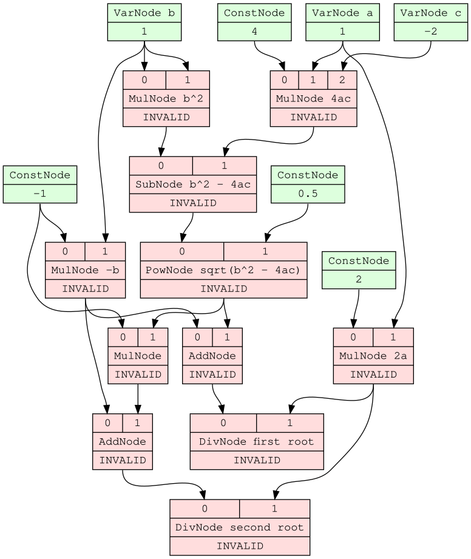
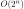
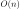
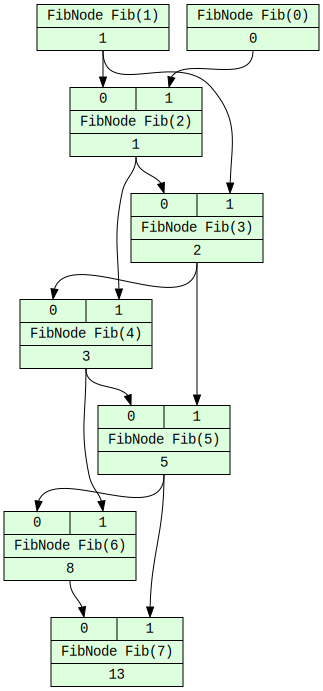
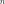
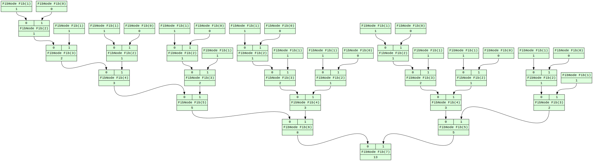

# lameflow

_A lazy and memoized dataflow computation framework for Python._

## About

`lameflow` represents computation as a directed acyclic graph, where nodes represent data and edges represent data dependencies. Each node is automatically invalidated when its dependencies change, and lazily evaluated when its value is requested.

## Graph Visualization

`lameflow` uses Graphviz to generate visualizations of the data dependency graph. Each node's dependencies (inputs) are shown at the top, and each node's value (output) is shown at the bottom.

Calculating the roots of a quadratic equation:



## Memoization

Nodes are implicitly memoized, since applying the same (pure) function to the same variables will always yield the same result. This simplifies the implementation of recursive dynamic programming algorithms, and also allows common subexpression elimination to occur at runtime.

Using Fibonacci numbers as an example: the naïve recursive algorithm is , while the memoized algorithm is . From the graph below, it is apparent how existing nodes are reused.



Without memoization, the calculation is much slower for large values of :



## Event Hooks

`lameflow` fires events for node creation, modification, state change, or dependency reconfiguration. This can be used for debugging or logging purposes. For example, to log every node creation event to the console:

```python
def listener(event):
    if isinstance(event, NodeCreateEvent):
        print(event)

NodeEvent.listeners.add(listener)
```
